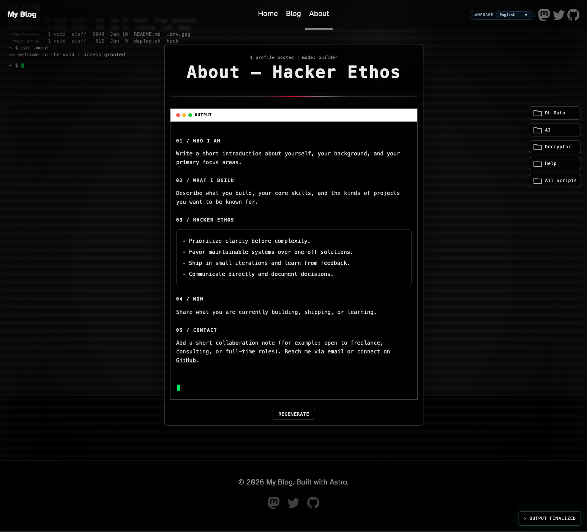

<h1 align="center">Anglefeint</h1>
<p align="center">A cinematic, multi-atmosphere Astro theme for personal publishing.</p>

<p align="center">
  <a href="https://demo.anglefeint.com/">Live Demo</a>
  ·
  <a href="https://github.com/anglefeint/astro-theme-anglefeint">Repository</a>
  ·
  <a href="https://github.com/anglefeint/astro-theme-anglefeint/blob/main/ASTRO_THEME_LISTING.md">Theme Listing</a>
</p>

<p align="center">
  
  
  
  
  
</p>

## Template Install

```bash
npm create astro@latest -- --template anglefeint/astro-theme-anglefeint#starter
```

For pnpm, use the npm command above to create the template (skip its dependency-install prompt), then enter the generated project and run:

```bash
pnpm install
```

## Requirements

- Node.js `22.12.0+` (LTS recommended)
- The 0.8.0 starter's documented commands passed Linux acceptance with npm on Node 22 and pnpm 10 on Node 24. Yarn/bun were not tested. See the [dated acceptance record](https://github.com/anglefeint/astro-theme-anglefeint/blob/main/docs/releases/0.8.0.md).

## Quick Start

```bash
npm install
npm run dev
```

Build and preview:

```bash
npm run build
npm run preview
```

Quality commands:

```bash
npm run doctor
npm run check
```

With `pnpm`:

```bash
pnpm install
pnpm dev
pnpm build
pnpm preview
```

## Upgrade Theme

For projects created from `#starter`, use the following only when the target release supports your existing starter and Astro version and requires no local structure changes:

```bash
npm update @anglefeint/astro-theme
npm run doctor
```

`npm update` stays within the range in `package.json`: `^0.5.1` does not include `0.6.0`. For a compatible update outside that range, follow the release notes and install an explicit target version, not blindly `@latest`. Check the installed versions with `npm ls @anglefeint/astro-theme astro`.

In the current starter, `doctor` already includes checks and a build. After it succeeds, use `npm run preview` to inspect the site. Only if it reports generated adapters out of sync with local templates, run `npm run sync-adapters`, then rerun `npm run doctor`; this does not download upstream templates. Older projects may have different scripts: inspect their `package.json` and follow the upgrade guide.

If release notes mention starter-side contract changes, create the latest template in a new directory and migrate your content and personal settings. Do not overwrite the new configuration helpers with old files. `npm update` only updates the published package; in-place upgrades across all historical starters are not guaranteed. See the [upgrade guide](https://github.com/anglefeint/astro-theme-anglefeint/blob/main/UPGRADING.md).

If your custom code still imports `src/consts` or `@anglefeint/astro-theme/consts`, migrate to `src/config/site.ts`.

For Astro major-version migrations, follow the official Astro guide first:

- https://docs.astro.build/en/guides/upgrade-to/
- then follow the validation checklist in the upgrade guide linked above.

## Create New Post

Create the same slug in all enabled locales:

```bash
npm run new-post -- my-first-post
```

Slug rule: use lowercase letters, numbers, and hyphens only (example: `my-first-post`).
If default covers exist in `src/assets/blog/default-covers/`, a stable cover is auto-assigned by slug hash (you can replace `heroImage` later).
Optional locale override:

```bash
npm run new-post -- my-first-post --locales en,fr
# or
ANGLEFEINT_LOCALES=en,fr npm run new-post -- my-first-post
```

The `ANGLEFEINT_LOCALES=...` syntax is for Bash/POSIX shells. In PowerShell, use the `--locales` command above.

How URL works:

- File: `src/content/blog/<locale>/my-first-post.md`
- URL: `/<locale>/blog/my-first-post/`
- Blog list: `/<locale>/blog/`
- You do not need to add routes manually. Astro generates them from content files at build time.

`--locales` creates article files but does not enable languages. Add/enable each target locale in `src/site.config.ts` for its routes to be generated.

## Create New Page

`new-post` creates blog content only. For custom pages, use:

```bash
npm run new-page -- projects --theme base
```

Available themes: `base`, `ai`, `cyber`, `hacker`, `matrix`.
The command creates `src/pages/[lang]/projects.astro` with locale routes via `getStaticPaths()`.
Slug rule: lowercase letters, numbers, and hyphens only; nested paths are allowed (example: `projects/labs`). `_` and uppercase are invalid.

Examples (choose one for `projects`; running all five will fail after the first because the file already exists):

```bash
npm run new-page -- projects --theme base
npm run new-page -- projects --theme ai
npm run new-page -- projects --theme cyber
npm run new-page -- projects --theme hacker
npm run new-page -- projects --theme matrix
```

## Languages

English (this file) · [简体中文](README.zh-CN.md) · [日本語](README.ja.md) · [Español](README.es.md) · [한국어](README.ko.md)

## Preview

| Home                                                           | Blog List                                                                |
| -------------------------------------------------------------- | ------------------------------------------------------------------------ |
|  |  |

| Blog Post                                                                     |
| ----------------------------------------------------------------------------- |
|  |

| About                                                            |
| ---------------------------------------------------------------- |
|  |

## Route Atmospheres

- `/<default-locale>/` (with `/` redirecting there by default): Matrix-inspired terminal landing
- `/:lang/blog`: cyberpunk archive mood
- `/:lang/blog/[slug]`: AI-interface reading layout
- `/:lang/about`: optional hacker-style profile page

## Theme Naming Contract

- Theme variants: `base`, `ai`, `cyber`, `hacker`, `matrix`
- Internal selectors/scripts use aligned prefixes: `ai-*`, `cyber-*`, `hacker-*`
- Core composition follows: `ThemeFrame -> Shell -> Layout -> Page`

## Features

- Pagefind article search in the current language
- Automatic article contents and static tag archives
- Code-block copy and article-body image preview
- Astro 7 static output
- Markdown + MDX content collections
- Starter ships sample locales: `en`, `ja`, `ko`, `es`, `zh`
- Per-locale RSS feeds
- Sitemap + robots support
- Config-driven customization
- Sticky footer (viewport-bottom on short pages)

## Theme Setup

1. Optionally copy `.env.example` to `.env` to override site identity; otherwise use `src/site.config.ts`.
2. Edit `src/site.config.ts`:
   - `site.title`, `site.description`, `site.url`, `site.author`, `site.tagline` for site identity and default metadata
   - `i18n.defaultLocale` to set the canonical root locale
   - `i18n.routing.defaultLocalePrefix` to choose whether the default locale lives at `/<default-locale>/` (default) or `/`
   - `i18n.locales` to add/remove supported locales from a single source
   - `i18n.locales.<code>.messages` for localized UI copy overrides
   - `i18n.locales.<code>.meta.label` for the language menu name (`zh` defaults to `简体中文`); changing it does not change URLs
   - `i18n.locales.<code>.site.hero` for localized home hero copy
   - `i18n.locales.<code>.about` for localized About content/runtime text
   - `social.links` for header/footer links
   - `theme.enableAboutPage` for About route/nav toggle
   - `theme.effects.enableRedQueen` to enable/disable the post-side monitor effect
   - `theme.comments` to enable and configure Giscus (core IDs + behavior options)
3. Replace starter posts in `src/content/blog/<locale>/`.
4. Set your real site URL (`PUBLIC_SITE_URL` or `src/site.config.ts`) before production deploy.

Notes:

- `site.description` is the site-level default. The home page first uses the resolved `messages.siteDescription`, including built-in and fallback-language messages; only an empty resolved value falls back to `site.description`. Changing `site.description` alone does not replace built-in home descriptions.
- Locale config is deep-merged with defaults. Disable an unwanted language with `i18n.locales.<code>.meta.enabled = false`; omitting its override does not remove it. The default locale remains enabled.
- Locale metadata currently supports `label`, `hreflang`, `ogLocale`, `enabled`, and `fallback`.

### Optional: Giscus Comments

Comments are disabled by default. To enable:

1. In `src/site.config.ts`, set `theme.comments.enabled = true`.
2. Fill:
   - `theme.comments.repo`
   - `theme.comments.repoId`
   - `theme.comments.category`
   - `theme.comments.categoryId`
3. Optionally customize:
   - `theme.comments.mapping`
   - `theme.comments.term` (required when `mapping = "specific"`)
   - `theme.comments.number` (required when `mapping = "number"`)
   - `theme.comments.strict`
   - `theme.comments.reactionsEnabled`
   - `theme.comments.emitMetadata`
   - `theme.comments.inputPosition` (`top` or `bottom`)
   - `theme.comments.theme`
   - `theme.comments.lang`
   - `theme.comments.loading`
   - `theme.comments.crossorigin`

Missing core IDs hides the comments block. When comments are enabled, an empty `term` for `mapping="specific"` or an invalid positive-integer `number` for `mapping="number"` throws a configuration error and can stop dev/build.

The CLI uses enabled locales from the merged config. Config errors stop generation; `--locales` or `ANGLEFEINT_LOCALES` explicitly overrides that lookup.

## Configuration Surface

- Single entry: `src/site.config.ts`
- Adapters (do not edit directly): `src/config/site.ts`, `src/config/theme.ts`, `src/config/about.ts`, `src/config/social.ts`
- Environment override supported: `PUBLIC_*` vars for site identity

## Docs

- [Architecture](https://github.com/anglefeint/astro-theme-anglefeint/blob/main/docs/ARCHITECTURE.md)
- [Visual systems](https://github.com/anglefeint/astro-theme-anglefeint/blob/main/docs/VISUAL_SYSTEMS.md)
- [Submission checklist](https://github.com/anglefeint/astro-theme-anglefeint/blob/main/docs/THEME_SUBMISSION_CHECKLIST.md)
- [Theme listing draft](https://github.com/anglefeint/astro-theme-anglefeint/blob/main/ASTRO_THEME_LISTING.md)
- [Upgrading guide](https://github.com/anglefeint/astro-theme-anglefeint/blob/main/UPGRADING.md)
- [Changelog](https://github.com/anglefeint/astro-theme-anglefeint/blob/main/CHANGELOG.md)

## Article Search

Search is enabled by default. The header button searches article titles and body text in the current language. `npm run build` generates the index automatically, deployed with the static site without a search server or account.

Set `theme.search.enabled: false` in `src/site.config.ts` to disable the entry and index generation. Use `search: false` in article frontmatter to exclude one article. Navigation, contents panels, related posts, comments and decorative status text are excluded.

Test full search with `npm run build` followed by `npm run preview`. `npm run dev` shows a development notice instead of live search. Rebuild after editing articles to update the index.

## Article Contents

Article pages automatically show a collapsible table of contents for Markdown `##` and `###` headings. On wide screens it sticks beside the article on the right; on narrower screens it appears before the body. It opens by default and is hidden when there are no matching headings. Long titles wrap, and headings keep their original text without added numbering.

Set `theme.toc.enabled` in `src/site.config.ts` to change the site default (initially `true`). In an article's frontmatter, `toc: false` hides its contents and `toc: true` shows them even if the site default is off. Omit `toc` to inherit the site default.

MDX Markdown headings are supported. Headings generated inside components or written as raw HTML/JSX are not automatically collected. Custom layouts using `BlogPost` must pass the `headings` returned by Astro's `render(post)`; omitting them leaves the contents hidden.

## Tag browsing

Add `tags: ["Astro", "frontend"]` to an article's frontmatter. Builds automatically generate a tag directory and paginated article lists for each enabled language. Blog pages link to the directory; article tags link to matching lists. Untagged articles remain unchanged. Disable browsing with `theme: { tags: { enabled: false } }` in `src/site.config.ts`.

Names are case-sensitive; surrounding spaces and duplicate tags are removed. Lowercase URL-safe names retain readable paths; other names use stable encoded paths, so Chinese and punctuation remain distinct. Renaming a tag changes its URL. No separate tag registry or command is needed.

Open `/<locale>/tags/` directly or use the blog's Tags link. An article tag opens `/<locale>/tags/<tagSlug>/`. With no tags in that language, the directory is empty and its blog navigation entry is hidden.

## Code block copy

Code blocks automatically show a copy button in the upper-right corner. Write ordinary Markdown fenced code; no extra configuration is needed. Clipboard access requires HTTPS or localhost; failures show a manual-copy message.

## Image preview

Unlinked images in article bodies open a larger preview on click or Enter/Space. Close with Escape, the close button, or the backdrop; reading position is preserved. Linked images keep their original navigation.

Preview displays the image source already selected by the browser; it does not retrieve a higher-resolution original. Hero images and images inside links or buttons are excluded.

## Article share images

Available in 0.5.0 with its matching starter; 0.4.0 does not include this feature.

`npm run build` automatically creates a 1200×630 PNG for each article without an `ogImage`, using its title, author and site name. Generation uses bundled fonts, with no image API or browser JavaScript. The article's `heroImage` is independent.

Set `ogImage: ./share.png` in article frontmatter to use your own image beside the article, or `ogImage: /images/share.png` for `public/images/share.png`. HTTPS image URLs are also supported; their availability and caching remain your responsibility. Missing local images fail the build.

Disable automatic generation with `theme: { socialImage: { enabled: false } }` in `src/site.config.ts`. Explicit `ogImage` still wins; other articles fall back to their hero or the existing default image. Rebuild and deploy after changes. Generated files are in `dist/_social/`; the article HTML's `og:image` gives the exact URL. Content-dependent URLs help with updates, but platforms may cache link previews.

The bundled font covers the starter's Latin, Chinese, Japanese and Korean text. Very long titles are shortened on the image only; emoji and other writing systems are not guaranteed. Generation adds build time and installation size, without adding a font download to article pages.

## Credits

- Parts of the base typography CSS are adapted from Bear Blog defaults (MIT).
  Source note is preserved in `src/styles/global.css`.

## License

MIT License. See `LICENSE`.

## Optional music player

Disabled by default. Put audio files in `public/music/` and merge this into `src/site.config.ts`:

```ts
theme: {
  music: {
    enabled: true,
    tracks: [{ title: 'My Song', src: '/music/my-song.mp3' }],
  },
},
```

Each track accepts `title`, `src` and optional `artist`. HTTPS audio URLs are also supported. An empty playlist hides the player. Audio loads only after clicking Play. The player remembers the track, position and volume within the tab session; after navigation, click Play to resume. It does not provide uninterrupted playback across pages.
