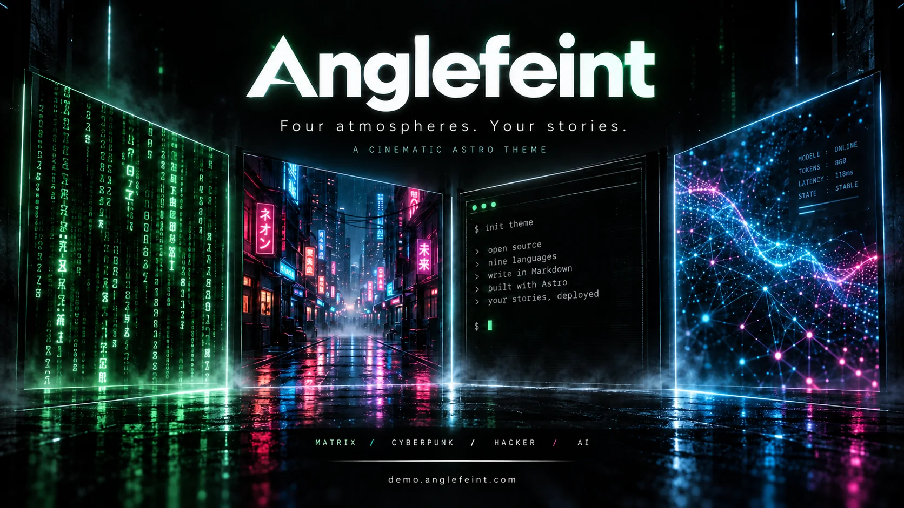
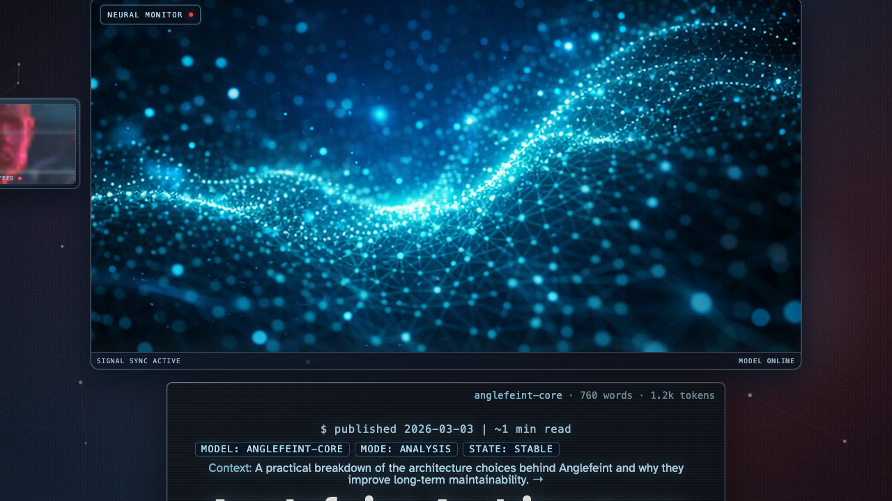
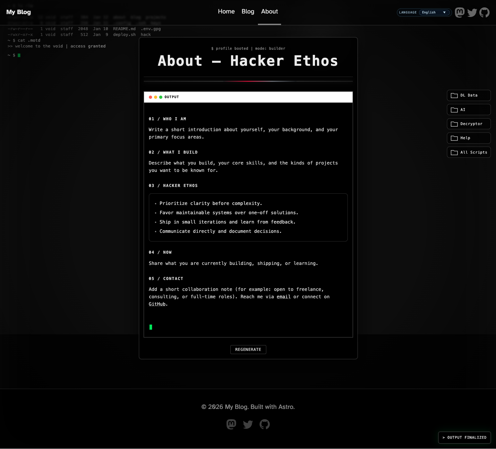

[English](README.md) · [简体中文](README.zh-CN.md) · [日本語](README.ja.md) · [한국어](README.ko.md) · [Español](README.es.md) · [Português (Brasil)](README.pt-BR.md) · [Deutsch](README.de.md) · [Русский](README.ru.md) · [繁體中文](README.zh-Hant.md)

<p align="center">
  <a href="https://demo.anglefeint.com/pt-br/">
    
  </a>
</p>

<p align="center">Um tema Astro cinematográfico para publicar com personalidade.</p>

[Demo](https://demo.anglefeint.com/pt-br/) · [GitHub](https://github.com/anglefeint/astro-theme-anglefeint)

<p align="center">
  <a href="#installation">Instalação</a> · <a href="#setup">Guia de configuração</a>
</p>

<p align="center">
  
  
  
</p>

<a id="installation"></a>

```bash
npm create astro@latest -- my-blog --template anglefeint/astro-theme-anglefeint#starter --no-install
```

<a id="setup"></a>

## Links sociais

Configure `social.links` em `src/site.config.ts`; cabeçalho e rodapé compartilham a ordem do array. Adicione apenas os links que você usa:

```ts
// src/site.config.ts — defineThemeConfig({ ... })
social: {
  links: [
    { href: "https://www.youtube.com/@your-channel", label: "YouTube", icon: "youtube" },
    { href: "https://bsky.app/profile/your-handle.bsky.social", label: "Bluesky", icon: "bluesky" },
  ],
},
```

Nomes de `icon` incluídos: `mastodon`, `twitter`, `github`, `youtube`, `bluesky`, `linkedin`, `discord`, `telegram`, `instagram`, `facebook`, `whatsapp`, `line`.

O campo opcional `rel` aceita valores separados por espaços, como `me` ou `me nofollow`, com ícones, imagens próprias ou texto. Ausente ou vazio mantém `noopener noreferrer`. Os valores são convertidos para minúsculas e deduplicados; as proteções são mantidas e `opener` é ignorado. Nenhuma plataforma adiciona `me` automaticamente: use apenas para sua própria identidade. Para a [verificação do Mastodon](https://docs.joinmastodon.org/user/profile/#link-verification), publique e salve a URL HTTPS nos campos do perfil. Use uma página com o link de retorno, como `/en/`; a página de redirecionamento HTML da raiz pode não contê-lo. A verificação é feita pelo servidor Mastodon.

```ts
{ href: "https://mastodon.social/@yourname", label: "Mastodon", icon: "mastodon", rel: "me" },
```

Para uma imagem própria, coloque `community.svg` em `public/icons/` e defina `iconSrc: "/icons/community.svg"` no link. São aceitos SVG, PNG e WebP locais. Use um caminho iniciado por `/`, sem URL remota, consulta, fragmento ou caracteres codificados. O `base` do Astro é adicionado automaticamente. Arquivos ausentes ou nomes de ícones não suportados geram erro de configuração no desenvolvimento/build.

Prioridade: `iconSrc` → `icon` → texto. Ícones incluídos herdam a cor do menu; imagens próprias mantêm suas cores. `label` fornece o nome acessível. No rodapé, os links quebram linha quando necessário; o cabeçalho mantém uma linha com rolagem horizontal quando falta espaço. Em larguras de até 720px, continuam ocultos no cabeçalho e visíveis no rodapé. Um array `links` vazio mantém os três marcadores não clicáveis. Refaça o build e o deploy após alterações.

## Guia 1: Configure seu blog

### Instalar e abrir localmente

Use Node.js 22.12.0 ou superior. O comando acima cria uma única vez a nova pasta `my-blog` e pula a instalação das dependências. Responda às outras perguntas e continue abaixo; se mudar o nome da pasta, ajuste também `cd`.

```bash
cd my-blog
npm install
npm run dev
```

O servidor de desenvolvimento continua ativo. Antes dos próximos comandos, pare-o com `Ctrl+C` ou abra outro terminal dentro de `my-blog`. Execute todos os comandos seguintes na pasta do projeto. Não crie o projeto novamente.

Abra o endereço indicado no terminal. Para pnpm, crie o projeto com o mesmo comando npm, pule a instalação no assistente e execute pnpm install e pnpm dev.

### Identidade e endereço inicial

Edite o objeto em src/site.config.ts, mantendo imports e exports. Substitua domínio, nome, autor e textos pelos seus. Mescle o exemplo com suas configurações existentes.

```ts
export const THEME_CONFIG = defineThemeConfig({
  site: { title: 'My Blog', author: 'Your Name', url: 'https://your-domain.example' },
  i18n: {
    defaultLocale: 'pt-br',
    routing: { defaultLocalePrefix: 'never' },
    locales: {
      'pt-br': {
        site: { hero: 'My Blog' },
        messages: { siteDescription: 'My Blog' },
      },
    },
  },
});
```

site.url define o domínio usado por canonical, RSS, sitemap e imagens sociais. PUBLIC_SITE_URL no ambiente de compilação ou no arquivo .env tem prioridade. Reinicie o desenvolvimento ou reconstrua após alterá-lo. O texto visível da página inicial vem de site.hero do idioma; messages.siteDescription define sua descrição. Alterar apenas site.description não substitui esses textos.

Com defaultLocalePrefix: 'never', a página inicial do idioma padrão aparece diretamente em /. O padrão 'always' redireciona / para /<idioma>/ e pode exibir “Redirecting to home…”. Artigos continuam em /pt-br/blog/ mesmo com 'never'.

Configure social.links com href, label e icon (github, twitter ou mastodon). Uma lista vazia mantém ícones ilustrativos sem links. site.tagline adiciona texto ao rodapé.

Os parágrafos e a assinatura de Sobre preservam quebras de linha da configuração: `\n` inicia outra linha e `\n\n` deixa uma linha em branco. Frases longas continuam quebrando automaticamente. É texto simples, sem Markdown ou HTML; não insira `<br>`.

O rodapé separa copyright, créditos do tema/Astro e o texto opcional `site.tagline`, com ícones sociais abaixo. Os créditos seguem o idioma da página; seu texto permanece igual em todos os idiomas. Texto vazio não ocupa espaço e textos longos quebram linha no celular. A configuração existente e `PUBLIC_SITE_TAGLINE` continuam funcionando; nenhuma migração é necessária.

### Escolher idiomas

Nove idiomas estão ativos: en, ja, ko, es, zh, pt-br, de, ru e zh-hant. Inglês é o padrão inicial. Para desativar idiomas, mescle entradas como estas:

```ts
i18n: {
  locales: {
    ja: { meta: { enabled: false } },
    ko: { meta: { enabled: false } },
  },
},
```

Omitir um idioma não o desativa: a configuração é mesclada com os padrões. O idioma padrão permanece ativo. Para um blog em apenas um idioma, desative explicitamente os outros oito. Isso não apaga arquivos nem traduz textos.

### Substituir exemplos e escrever

Cada idioma do starter tem uma página de boas-vindas e três guias. Faça backup e remova os exemplos que não quiser; preserve imagens ainda utilizadas.

```bash
npm run new-post -- my-first-post --locales pt-br
```

Comece com um artigo em português do Brasil. Sem `--locales pt-br`, o comando cria modelos para todos os idiomas ativos (inicialmente nove), sem tradução automática. Os arquivos existentes são preservados. Edite título, descrição e corpo em src/content/blog/pt-br/my-first-post.md.

### Verificar e publicar

```bash
npm run doctor
npm run preview
```

doctor inclui verificações e compilação. preview exibe o resultado localmente; não publica na internet. O site estático fica em dist/, com busca e imagens sociais. No provedor, use npm run build e dist como saída. Siga o [guia de implantação do Astro](https://docs.astro.build/en/guides/deploy/) e confira páginas, idiomas, busca e /pt-br/rss.xml após publicar.

### Regras de configuração

Mantenha um único objeto theme e um único i18n. Mescle opções; listas substituem listas anteriores. Não edite os adaptadores gerados em src/config/. Atualizar o pacote npm não atualiza arquivos locais do starter. Consulte o [guia de atualização](https://github.com/anglefeint/astro-theme-anglefeint/blob/main/UPGRADING.md) antes de migrar.

- [Guia 2: Escreva e organize conteúdo](https://demo.anglefeint.com/pt-br/blog/starter-guide-2-languages-and-routing/)

## Idiomas

Nove idiomas ativos por padrão: `en`, `ja`, `ko`, `es`, `zh`, `pt-br`, `de`, `ru`, `zh-hant`. `new-post` cria nove arquivos inicialmente, sem traduzir o texto. Desative os idiomas desnecessários com `meta.enabled: false` em `src/site.config.ts`; omitir uma entrada não a desativa. O idioma padrão permanece ativo. Para criar só português: `npm run new-post -- my-post --locales pt-br`.

## Guia 2: Escreva e organize conteúdo

### Criar um artigo

```bash
npm run new-post -- my-first-post --locales pt-br
```

Para criar somente português, use npm run new-post -- my-first-post --locales pt-br. Use letras minúsculas, números e hífens no slug. O arquivo src/content/blog/pt-br/my-first-post.md gera /pt-br/blog/my-first-post/. Arquivos existentes são preservados. --locales cria arquivos, mas não ativa idiomas.

Traduções usam o mesmo slug. Sem tradução, o menu leva à lista do idioma escolhido; hreflang não apresenta essa lista como tradução do artigo.

### Preencher o cabeçalho

```yaml
---
title: 'My first post'
description: 'My notes and projects'
pubDate: '2026-10-03'
tags: ['astro', 'notes']
---
```

title, description e pubDate são obrigatórios. subtitle, updatedDate e author são opcionais; o autor padrão vem do site. Artigos são ordenados por pubDate. Não há filtro de rascunho ou agendamento: draft: true e datas futuras não ocultam artigos. Guarde textos inacabados fora de src/content/blog/.

heroImage: ./cover.jpg usa uma imagem ao lado do artigo. O comando escolhe uma capa estável quando há arquivos em src/assets/blog/default-covers/. Não baixa imagens. Tempo de leitura e métricas são estimativas; readMinutes, wordCount, tokenCount, aiLatencyMs e aiConfidence podem substituí-las, sem conectar um serviço de IA.

### Sumário e tags

Use títulos Markdown ## e ###. O sumário aparece à direita em telas largas e acima do texto em telas pequenas. Sem títulos, ele fica oculto. toc: false desativa por artigo; toc: true prevalece sobre o padrão do site. Títulos criados por componentes MDX ou HTML não são coletados automaticamente.

tags: ['astro', 'notes'] cria arquivos de tags em /pt-br/tags/. Maiúsculas e minúsculas diferem; espaços nas pontas e duplicatas são removidos. Nomes não latinos recebem URLs codificadas. Renomear uma tag altera seu endereço. theme.tags.enabled: false desativa links e páginas.

### Imagens e código

Use `` ou ``, fornecendo o arquivo correspondente. Imagens comuns do corpo abrem com clique ou Enter/Espaço e fecham com Escape, botão ou fundo. Capas e imagens dentro de links ou botões ficam de fora. A prévia usa a imagem já selecionada pelo navegador, sem baixar um original maior.

Blocos Markdown cercados por três crases recebem um botão de cópia. Ele preserva a formatação e exige HTTPS ou localhost; em caso de falha, copie manualmente.

### Busca

Execute npm run build e npm run preview. A busca pesquisa títulos e corpo no idioma atual. Em dev há apenas um aviso. search: false exclui um artigo do índice, mas não o esconde das listas ou do acesso direto. theme.search.enabled: false desativa a busca e o índice. Reconstrua após editar artigos.

### Imagens de compartilhamento

Sem ogImage, a compilação gera um PNG de 1200×630 com título, autor e nome do site. Isso não altera heroImage. Use ogImage: ./share.png ou /images/share.png para uma imagem própria; HTTPS também funciona. Arquivos locais ausentes causam erro. Imagens externas dependem do serviço externo.

Os cartões automáticos usam um fundo incluído de chuva de código, terminais e redes de neon, com o nome do seu site, título e autor. O pequeno crédito `Theme by Anglefeint` no canto inferior direito segue `theme.footer.showCredits` (padrão `true`); `false` oculta os créditos do rodapé e da imagem. Compile e publique novamente após alterar. Arquivos `ogImage` personalizados não são modificados. O fundo funciona offline e não adiciona JavaScript ao navegador.

ogImage explícito tem prioridade. theme.socialImage.enabled: false desativa só a geração; as demais imagens usam capa ou imagem padrão. Confira og:image no HTML e os arquivos em dist/\_social/. Plataformas podem manter prévias antigas em cache. Emojis e todas as escritas do mundo não são garantidos.

### Páginas independentes

npm run new-page -- projects --theme cyber cria src/pages/[lang]/projects.astro. Edite seu conteúdo; o comando não traduz nem adiciona navegação. Temas: base, ai, cyber, hacker e matrix. Slugs aceitam caminhos como projects/labs. Um arquivo existente causa erro.

- [Guia 2: Escreva e organize conteúdo](https://demo.anglefeint.com/pt-br/blog/starter-guide-2-languages-and-routing/)

## Guia 3: Recursos opcionais

### Música

Coloque o áudio em public/music/ e mescle:

```ts
theme: {
  music: { enabled: true, tracks: [{ title: 'My Song', src: '/music/my-song.mp3' }] },
},
```

Faixas aceitam title, src e artist opcional. Sem faixas, o player fica oculto. A primeira reprodução exige clique. A sessão guarda faixa, posição e volume; retomar depende das permissões do navegador, e pode haver uma pausa entre páginas. Ao terminar a última faixa, a primeira recomeça.

O arquivo completo é baixado antes de tocar; arquivos grandes aumentam espera e memória. Faixas externas exigem CORS. Prefira arquivos locais. enabled: false desativa o player.

### Opcional: Google Analytics 4

Adicione ou edite esta opção no nível superior do objeto `defineThemeConfig({...})` existente em `src/site.config.ts` (ao lado de `site`, não dentro de `theme`):

```ts
analytics: {
  googleAnalyticsId: 'G-XXXXXXXXXX',
},
```

Copie o **ID de medição** (`G-...`) em Google Analytics → Administrador → Fluxos de dados → seu fluxo da Web. Não é o nome nem o ID numérico da propriedade. Deixe vazio para desativar. Um ID atende todos os idiomas e páginas do tema; compare idiomas pelo caminho da página. Compile e publique novamente, visite o site e confira o relatório Em tempo real do GA4.

O modo de desenvolvimento e as prévias em localhost/loopback não enviam dados. Prévias remotas ou por endereço LAN coletam dados quando configuradas. O starter padrão não carrega scripts do Google. Evite instalação duplicada por GTM, Zaraz ou código manual. Não inclui banner nem gerenciamento de consentimento; se seu site precisar, configure-os antes de ativar a coleta. Bloqueadores podem impedir a medição. Projetos existentes precisam dos arquivos auxiliares de configuração e do adaptador correspondentes; consulte o [guia de atualização](https://github.com/anglefeint/astro-theme-anglefeint/blob/main/UPGRADING.md).

### Comentários Giscus

Prepare um repositório público com Discussions, instale o aplicativo e obtenha os IDs em [giscus.app](https://giscus.app/).

```ts
theme: {
  comments: {
    enabled: true, repo: 'yourname/your-repository',
    repoId: 'REPLACE_WITH_REPO_ID', category: 'Announcements',
    categoryId: 'REPLACE_WITH_CATEGORY_ID', mapping: 'pathname', lang: '',
  },
},
```

Substitua os IDs e a categoria. Não cole um script em cada artigo. Campos essenciais vazios ocultam o componente. lang: '' acompanha o idioma: pt-br usa pt, zh-hant usa zh-TW e zh usa zh-CN. O padrão é inglês fixo.

mapping: 'pathname' associa discussões ao caminho. 'specific' exige term; 'number' exige number como texto com inteiro positivo. Valores inválidos causam erro. strict e reactionsEnabled usam '0' ou '1'. Se não aparecer, verifique IDs, permissões, conexão e bloqueios do navegador.

### Página Sobre

Edite i18n.locales['pt-br'].about: sections (who, what, ethos, now, contactLead, signature), contact (email, githubUrl, githubLabel), sidebar, labels, modals e effects. ethos é uma lista. Edite os demais idiomas separadamente. As ferramentas da página são demonstrações visuais, não serviços reais de IA. Um e-mail vazio oculta o link. theme.enableAboutPage: false remove página e navegação.

### Contagens e recursos

```ts
theme: {
  homeLatestCount: 3, blogPageSize: 9,
  enableAboutPage: true, effects: { enableRedQueen: true },
  search: { enabled: true }, toc: { enabled: true }, tags: { enabled: true },
  socialImage: { enabled: true }, footer: { showCredits: true },
},
```

Use false para desativar um recurso. enableRedQueen controla somente o monitor do artigo. toc: true no artigo pode prevalecer sobre a configuração global. socialImage desativa geração, mas mantém ogImage manual. Os ambientes são definidos pelos layouts, não por um seletor global.

homeLatestCount controla recentes; blogPageSize controla listas e tags. pagination.windowSize varia de 5 a 21. A entrada de salto aparece quando jump.enabled é true e o total excede showJumpThreshold, inicialmente 12. jump.enterToGo controla Enter. style.mode aceita fixed, sequential ou random; random é estável por página, não muda a cada atualização. style.enabled: false mantém paginação básica.

### Mais idiomas e endereço inicial

Adicione um código em i18n.locales com meta (label, hreflang, ogLocale, enabled, fallback), site.hero, messages e about. Depois crie artigos com --locales. fallback fornece textos de configuração ausentes; não traduz artigos nem mistura idiomas nas listas. O idioma padrão entra na cadeia de fallback quando necessário. Alterar label muda apenas o nome no menu.

defaultLocalePrefix: 'always' redireciona / para a página inicial localizada; 'never' faz o inverso para o idioma padrão. As rotas dos artigos continuam localizadas.

### Rodapé e verificação

footer.showCredits: false oculta os créditos do tema e do Astro, preservando o ano gerado e site.title. site.tagline adiciona texto independente. O antigo valor Built with Astro. é tratado como crédito interno para evitar duplicação.

Mescle todas as opções no mesmo theme ou i18n. Listas substituem listas anteriores. Teste em desenvolvimento, execute npm run doctor e use npm run preview para conferir a busca. Reconstrua e publique para aplicar mudanças.

- [Guia 2: Escreva e organize conteúdo](https://demo.anglefeint.com/pt-br/blog/starter-guide-2-languages-and-routing/)

## Atualização

Comece com o template público. Atualizações compatíveis do pacote usam npm update @anglefeint/astro-theme, seguido de npm run doctor.

npm update respeita a faixa em package.json: ^0.5.1 não inclui 0.6.0. Consulte as notas e instale uma versão explícita quando necessário, sem escolher @latest às cegas. npm ls @anglefeint/astro-theme astro mostra as versões instaladas.

O pacote não atualiza configuração, rotas, adaptadores ou integrações locais do starter. Quando a estrutura muda, crie um starter novo em outra pasta e migre seu conteúdo e configurações pessoais. Não sobrescreva os novos auxiliares com arquivos antigos.

doctor já inclui verificações e compilação. Depois use npm run preview. Execute npm run sync-adapters somente se houver divergência entre os adaptadores gerados e os templates locais; isso não baixa templates novos. Projetos antigos podem ter scripts diferentes.

Para mudanças de versão principal do Astro, siga primeiro a documentação oficial. Consulte o [guia de atualização](https://github.com/anglefeint/astro-theme-anglefeint/blob/main/UPGRADING.md).

```bash
npm update @anglefeint/astro-theme
npm run doctor
npm run preview
```

## Prévia






## Licença

MIT — [LICENSE](LICENSE).

## Fórmulas matemáticas

Artigos Markdown e MDX aceitam matemática no estilo LaTeX globalmente por padrão. Use `$C_{saved}$` em linha ou uma fórmula entre linhas separadas com `$$`. Não é necessário configurar cada artigo nem instalar plugins adicionais.

```markdown
Inline: $C_{saved}$

$$
\frac{a}{b}
$$
```

Desative com `theme: { math: { enabled: false } }` em `src/site.config.ts`. Escape dólares ambíguos como `\$`; trechos de código permanecem literais. Ao desativar, voltam as regras normais de MDX, incluindo expressões JavaScript entre chaves.

A renderização ocorre na compilação, com estilos e fontes locais e MathML acessível, sem motor matemático no navegador. Fórmulas longas têm rolagem horizontal. Erros interrompem a compilação indicando origem e causa. Mantenha títulos e descrições em texto simples; fórmulas ficam fora da busca. O suporte é à sintaxe matemática do KaTeX, não a documentos LaTeX completos.

Projetos antigos precisam da migração inicial do starter e da configuração descrita no guia de atualização; atualizar apenas o pacote não conecta o processador Markdown.

## Publicação estática

Execute `npm run build` e envie todo o conteúdo de `dist/` para a raiz do site estático. O servidor deve servir o `index.html` de cada diretório. Cloudflare é opcional e não é necessário Node.js em produção. Configure `site.url` e qualquer substituição `PUBLIC_SITE_URL` antes da compilação; recompile após alterações. Comentários, GA4 e áudio remoto opcionais continuam acessando seus serviços.

## Estatísticas dos artigos

A contagem é aproximada: caracteres CJK individualmente e o restante principalmente por espaços. Tokens são estimados por `round(max(words, 1) × 1.3)`, não por um tokenizador nem pelo uso real de IA. A partir de 1.000, usa-se uma casa decimal e k. `wordCount`, `tokenCount` e `readMinutes` no frontmatter substituem valores separadamente; mudar apenas wordCount não recalcula tokens. O código-fonte de fórmulas e MDX pode afetar as estimativas.
